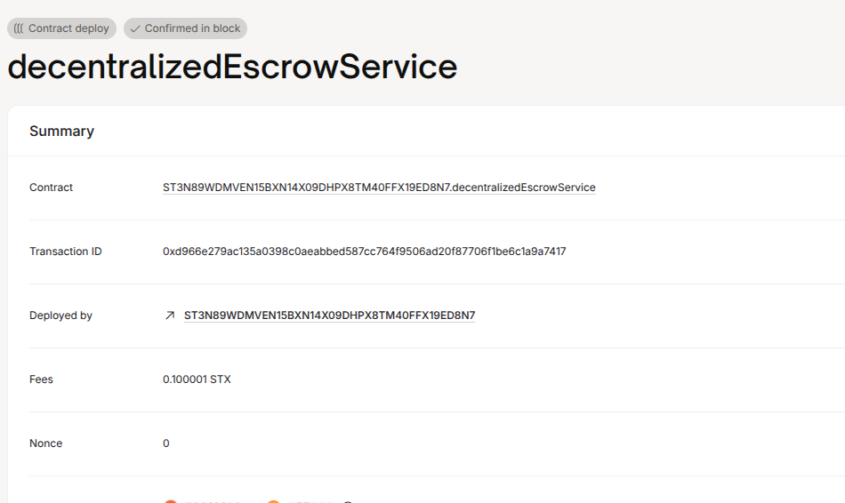

# Decentralized Escrow Service

## 📌 Project Description
This smart contract allows two parties (a buyer and seller) to transact securely using an escrow mechanism. The buyer deposits funds into the contract, and the seller can only claim them after the buyer’s approval.

## 🌐 Project Vision
To eliminate the need for third-party escrow services in freelance and peer-to-peer transactions by using smart contracts for fairness and automation.

## 🚀 Future Scope
- Add dispute resolution with a mediator.
- Include expiration time to auto-refund buyer.
- Support milestone-based or partial payments.
- Token-based escrow support beyond STX.

## 🔗 Contract Address
ST3N89WDMVEN15BXN14X09DHPX8TM40FFX19ED8N7.decentralizedEscrowService

